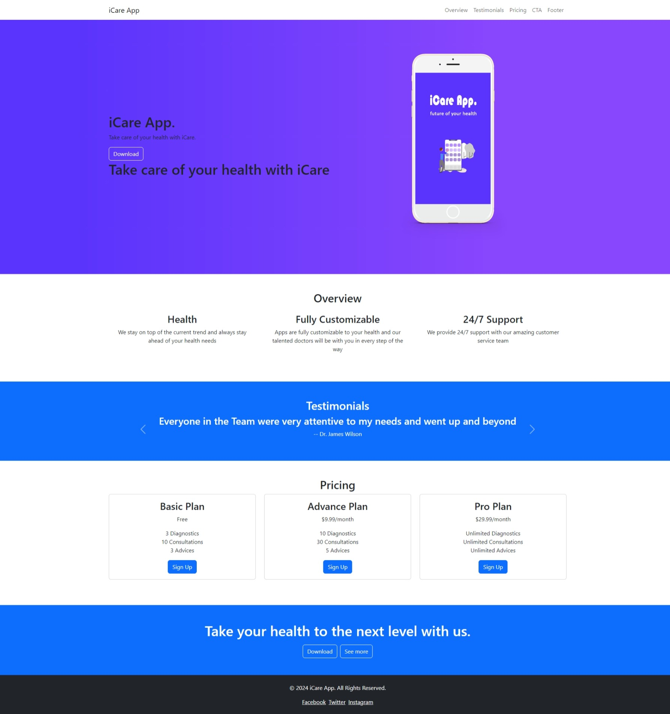
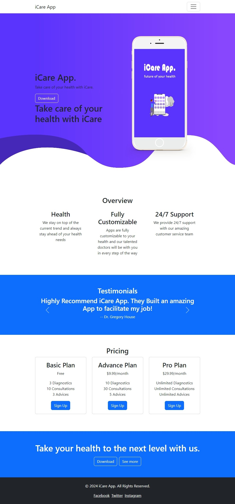
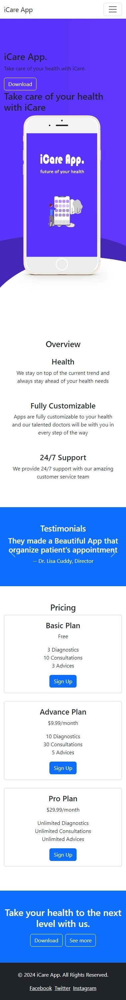

# iCare App Landing Page Project

Welcome to the iCare App landing page project. Follow the steps below to complete the project.

## Mockups

### Desktop View

### Tablet View

### Mobile View

## Step 1: Set Up the Project

- Initialize your project folder and create `index.html` and `styles.css` files.
- Add the basic structure for the HTML document and link the CSS file.

**Hint:** Use the provided template in the `index.html` file.

## Step 2: Header Section

- Create the header section with a navbar.

**Hint:** Use Bootstrap classes to style the navbar.

## Step 3: Main Section

- Add the main section with a heading and a button.

**Hint:** Use Bootstrap grid classes to align the elements.

## Step 4: Overview Section

- Create the overview section with three columns.

**Hint:** Use Bootstrap columns and custom styles for padding.

## Step 5: Testimonials Section

- Add the testimonials section with a carousel.

**Hint:** Use the Bootstrap carousel component for this section.

## Step 6: Pricing Section

- Create the pricing section with three pricing cards.

**Hint:** Use Bootstrap card components and custom styles.

## Step 7: Call to Action Section

- Add the call to action section with a heading and buttons.

**Hint:** Use Bootstrap buttons and custom styles.

## Step 8: Footer Section

- Create the footer section with links.

**Hint:** Use Bootstrap utility classes for styling.

## Step 9: Final Touches

- Add any final touches to the project, such as custom styles or additional content.

**Hint:** Refer to the `styles.css` file for custom styles.

## Resources

- [Bootstrap Documentation](https://getbootstrap.com/docs/5.3/)
- [Google Fonts](https://fonts.google.com/)

Good luck and happy coding!
